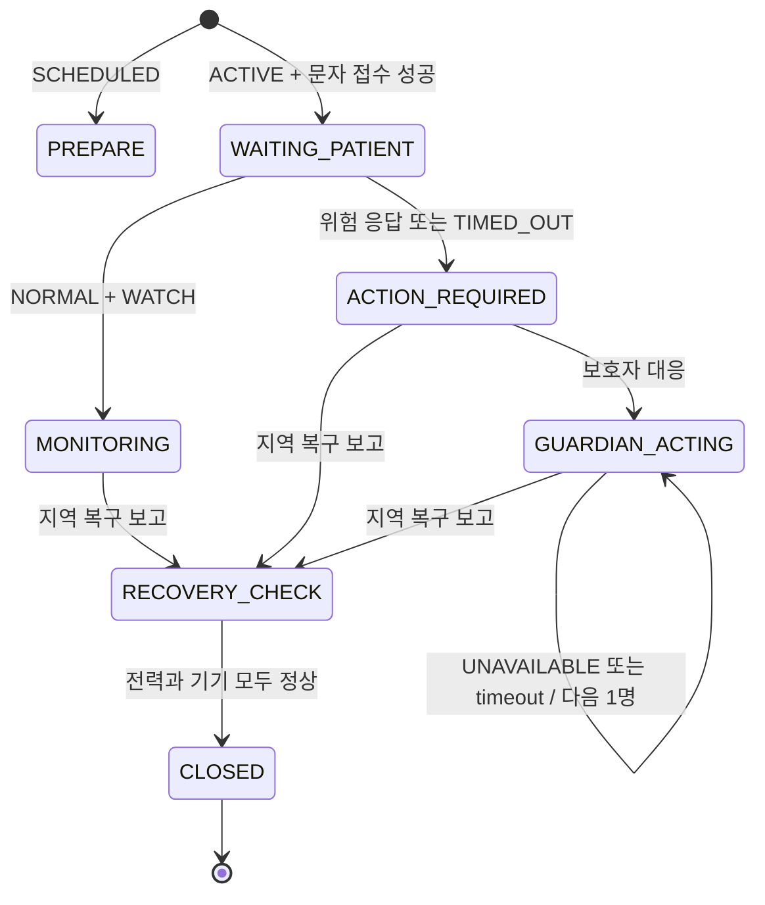
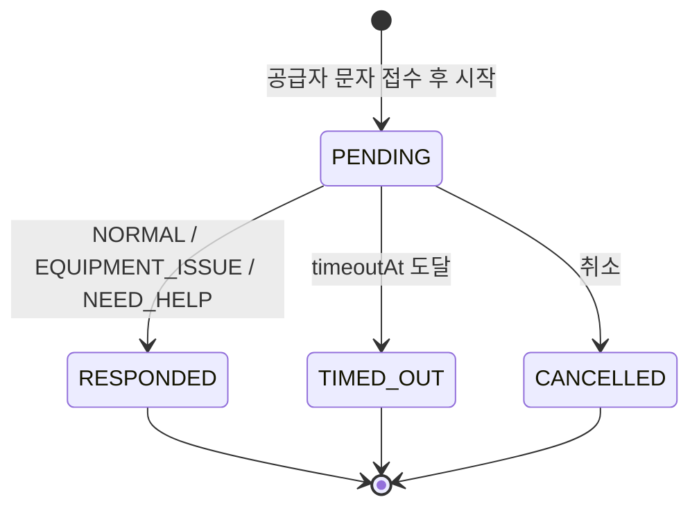

# Backend 2 계약

이 문서는 현재 `backend/b` 구현을 기준으로 백엔드 1과 백엔드 2의 책임, 입력 스냅샷, 반환 결정 및 외부 포트의 경계를 정의한다. Backend 2는 프레임워크 없는 코어 결정 엔진이며 운영 데이터의 시스템 오브 레코드가 아니다.

## 소유권과 책임

| 영역 | 백엔드 1 | 백엔드 2 |
| --- | --- | --- |
| 환자, 정전, 대응 건, StatusCheck, GuardianAction, 복구 응답의 DB 저장 | 소유 | 소유하지 않음 |
| DB 트랜잭션, ORM, 마이그레이션 | 소유 또는 후속 작업 | 소유하지 않음 |
| HTTP API, 인증, 웹훅 | 소유 또는 후속 작업 | 소유하지 않음 |
| 운영 스케줄러와 작업 영속화 | 소유 또는 후속 작업 | 작업 종류·실행 시각 결정 및 인메모리 큐 제공 |
| 환자·정전 매칭, 안전시간·위험도 계산 | 입력 제공·결과 저장 | 결정 로직 소유 |
| StatusCheck 상태 전이 결정 | 스냅샷 저장·전달 | 순수 전이와 timeout 판단 |
| GuardianAction | 생성·저장·스냅샷 전달 | 다음 순번 이동 가능 여부 판단 |
| 문자 발송 기록 영속화 | 운영 저장소 어댑터 소유 | 발송 결정, 중복 키, 인메모리 저장소 구현 |
| 운영 ResponseLink 토큰 생성·저장·검증 | 소유 | 소유하지 않음 |
| TEST ResponseLink | 사용 가능 | 비영속 fake 제공 |
| SOLAPI 인증, 계정, 발신번호, 실발송 | 소유 또는 후속 작업 | 인증 완료 클라이언트를 받는 얇은 어댑터만 제공 |
| 배포 | 소유 또는 후속 작업 | 범위 밖 |

## 백엔드 1에서 받는 입력 스냅샷

백엔드 1은 저장된 현재 상태를 호출 시점의 스냅샷으로 전달한다. Backend 2는 이를 저장하지 않는다.

- 정전: `id`, `mode`, `status`, 지역코드 또는 주소 범위, `startedAt` 또는 예정 시각
- 환자: 식별자, 전화번호, 위치, 전원 프로필, `emergencyContacts`, `institutionContacts`
- 기존 대응 건: 중복 방지와 현재 업무·위험 상태에 필요한 필드
- StatusCheck: `id`, `purpose`, `status`, `requestedAt`, `timeoutAt`, 응답 스냅샷
- 복구 확인: `homePowerRestored`, `deviceOperatingNormally`, 완료 여부
- GuardianAction: 현재 보호자의 `status`, 또는 `guardianActionTimedOut`
- 현재 시각과 적용할 위험도 정책

## 백엔드 2가 반환하거나 실행하는 결정·명령

현재 구현은 모든 효과를 하나의 명세 배열로만 반환하지 않는다. 실제 동작은 다음과 같다.

- 생성·갱신된 plain `ImpactCase`와 `StatusCheck` 객체 반환
- 생성·중복 제외 결과, 준비 문자 결과, 상태 확인 시작 결과 반환
- 알림 서비스를 호출하고 `NotificationDelivery`를 알림 저장소에 기록
- 작업 큐의 `schedule()`을 호출하고 예약 작업을 큐에 기록
- 보호자·기관 알림 결과 또는 `skipped`, `reason`, 기존 호환용 `error` 반환
- 종료 가능 여부를 boolean 결정으로 반환

운영 환경에서 이 결과와 효과를 트랜잭션·멱등 방식으로 영속화하는 책임은 백엔드 1에 있다.

## 업무 상태와 위험도 분리

환자 대응 업무 상태와 위험도는 서로 다른 축이다. 지역 복구, 복구 확인, 보호자 순번 이동은 기존 `riskLevel`을 재계산하거나 낮추지 않는다.

업무 상태:

- `PREPARE`: 예고 정전 준비
- `WAITING_PATIENT`: 환자 상태 확인 대기
- `MONITORING`: 현재 관찰 상태
- `ACTION_REQUIRED`: 조치 필요
- `GUARDIAN_ACTING`: 보호자 대응 중
- `RECOVERY_CHECK`: 복구 확인 중
- `CLOSED`: 대응 종료

위험도:

- `WATCH`
- `HIGH`
- `CRITICAL`



위 흐름은 업무 상태 흐름이다. `WATCH`, `HIGH`, `CRITICAL`은 별도 값으로 보존된다.

## StatusCheck와 실제 환자 응답

StatusCheck 생명주기:

- `PENDING`
- `RESPONDED`
- `TIMED_OUT`
- `CANCELLED`

실제 환자 응답:

- `NORMAL`
- `EQUIPMENT_ISSUE`
- `NEED_HELP`

`NO_RESPONSE`는 환자 응답값이 아니다. 무응답은 `StatusCheck.status = TIMED_OUT`으로 표현한다.



## DEMO_ONLY 위험도 정책

현재 기본 정책은 제품·의료 담당자가 승인한 운영 정책이 아니다.

| 필드 | 값 |
| --- | --- |
| `policyId` | `DEMO_ONLY` |
| `policyVersion` | `1` |
| `responseTimeoutSeconds` | `10` |
| `watchRatioThreshold` | `0.5` |
| `criticalRatioThreshold` | `0.2` |

위험도 판정 결과와 `ImpactCase`에는 판정에 사용한 `policyId`와 `policyVersion`을 보존한다.

안전시간 필수 입력이 누락되거나 음수·비수·잘못된 날짜이면 `SafetyTime.status = UNKNOWN`이다. UNKNOWN을 안전하다고 추정하지 않으며 위험도는 최소 `HIGH`로 판정한다. 유효 자립시간 또는 남은 시간이 0이면 `CRITICAL`이다.

## 알림 계약

문자 중복 식별자는 다음 네 값의 조합이다.

```text
impactCaseId:notificationType:recipientId:escalationRound
```

호출자가 임의 중복 키를 덮어쓸 수 없다. `NotificationDelivery`는 모드, 수신자, 템플릿, 상태, 시도 이력, 공급자 메시지 ID와 성공 시 `providerAcceptedAt`을 포함한다.

### 문자 성공 후 StatusCheck 시작 순서

1. `reserveLink({ impactCaseId, purpose })`로 링크를 예약한다.
2. 환자 문자를 발송한다.
3. 공급자가 접수한 경우 `providerAcceptedAt`을 기록한다.
4. `requestedAt = providerAcceptedAt`으로 StatusCheck를 생성한다.
5. `timeoutAt = providerAcceptedAt + responseTimeoutSeconds`로 계산한다.
6. `activateLink({ linkId, expiresAt: timeoutAt })`로 링크를 활성화한다.
7. `timeoutAt`에 timeout 작업을 예약한다.

문자 실패 시 StatusCheck와 timeout 작업을 만들지 않고 `STATUS_CHECK_NOT_STARTED`를 반환한다. 예약 링크도 활성화하지 않는다. 이후 알림 재시도가 성공하면 `startStatusCheckAfterSuccessfulRetry()`로 재진입하며, 재시도 성공 시의 `providerAcceptedAt`부터 동일한 순서를 시작한다.

### ResponseLink 포트

```text
reserveLink({ impactCaseId, purpose }) -> { linkId, url }
activateLink({ linkId, expiresAt }) -> { linkId, expiresAt }
```

Backend 2의 TEST 구현은 결정적 비영속 링크만 제공한다. 운영 토큰의 생성·저장·검증·소비는 전적으로 백엔드 1 책임이다. 기존 비-StatusCheck 호출의 호환성을 위해 `issueLink()` helper도 현재 남아 있다.

### 알림 저장소 포트

현재 `InMemoryNotificationStore`는 다음 동작을 제공한다.

- 중복 키 조회
- Delivery 저장·ID 조회
- 실패 Delivery 목록 조회

운영 영속 저장소와 DB 고유 제약은 백엔드 1 어댑터가 제공해야 한다.

### TEST/LIVE와 SOLAPI 경계

- `TEST`는 `MockSmsProvider`만 허용한다.
- `LIVE`는 `MockSmsProvider`를 금지한다.
- 이 검증은 최초 발송과 재시도 모두 적용된다.
- `SolapiSmsProvider`는 인증 완료된 `client.sendOne()`과 검증된 발신번호를 주입받는 어댑터다.
- 실제 SOLAPI 인증 구성과 실발송 연결은 아직 완료되지 않았으며 Backend 2 저장소에 키나 발신번호를 두지 않는다.

## 작업 큐 포트

현재 `InMemoryJobQueue`의 포트는 다음과 같다.

```text
schedule({ type, runAt, payload, idempotencyKey })
runDue({ now, handlers })
```

작업 종류는 `STATUS_CHECK_TIMEOUT`, `RECOVERY_TIMEOUT`, `NOTIFICATION_RETRY`이다. StatusCheck 작업 payload는 현재 `{ impactCaseId, statusCheckId }`이다. 운영 스케줄러, 재시작 가능한 작업 저장소, 락과 분산 실행은 백엔드 1 또는 후속 작업 영역이다.

## 보호자 순차 에스컬레이션

보호자는 `contactOrder` 순으로 선택하며 한 호출에서 한 명만 이동한다. 현재 보호자 이후 다음 순번으로 이동하려면 백엔드 1이 다음 중 하나의 근거를 전달해야 한다.

- `GuardianAction.status === "UNAVAILABLE"`
- `guardianActionTimedOut === true`

근거 없는 호출, `COMPLETED`, 대응 중 상태 또는 이미 종료된 대응은 이동하지 않는다. 마지막 보호자가 UNAVAILABLE 또는 timeout이면 기관으로 이동한다. 이 경로에서 기존 `riskLevel`은 유지된다.

## 복구 에스컬레이션

지역 복구가 보고되면 환자에게 복구 확인을 먼저 요청한다. 보호자 에스컬레이션은 다음 실제 근거 중 하나가 있을 때만 가능하다.

- 복구 `StatusCheck.status === TIMED_OUT`
- `homePowerRestored === false`
- `deviceOperatingNormally === false`

PENDING, 전력·기기 모두 정상, 이미 완료된 복구 확인, 근거 없는 호출은 `skipped: true`와 이유를 반환하고 발송하지 않는다. 지역 복구 이후와 복구 에스컬레이션 전체에서 기존 `riskLevel`은 유지된다.

## 연락처 없음

보호자 또는 기관 연락처가 없으면 null 번호로 SMS Provider를 호출하지 않는다. 결과는 `notified: "NONE"`, `skipped: true`, `reason: "NO_RECIPIENT_AVAILABLE"`로 표현하며 기존 호환 경로에서는 같은 값의 `error`도 유지한다. 예고 정전에서 보호자가 없으면 환자 문자만 발송하고 `NO_GUARDIAN_AVAILABLE`을 반환한다.

## 종료 결정

- 대응 건 종료 가능: 가구 전력과 의료기기가 모두 정상으로 확인되어야 한다.
- 정전 이벤트 종료 가능: 대응 건 스냅샷이 하나 이상 존재하고 모든 대응 건 상태가 `CLOSED`여야 한다.

Backend 2는 가능 여부만 결정한다. 실제 상태 저장과 정전 종료 트랜잭션은 백엔드 1 책임이다.

## 현재 범위 밖

실제 DB, ORM, 마이그레이션, HTTP API, 인증, 운영 토큰, 운영 스케줄러, 웹훅, 배포, SOLAPI 인증과 실발송은 Backend 2의 현재 구현 범위가 아니다. 백엔드 1 또는 명시적인 후속 작업에서 구현한다.
